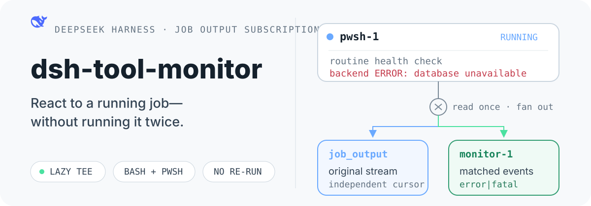

<p align="center">
  
</p>

<p align="center">
  <strong>让 DeepSeek Harness 在后台服务出错时立即收到事件。</strong><br>
  订阅已经运行的 Bash 或 PowerShell Job；保留原始 <code>job_output</code>，不启动第二个业务进程。
</p>

<p align="center">
  <a href="#快速开始">快速开始</a> ·
  <a href="#为什么需要它">为什么需要它</a> ·
  <a href="#工作方式">工作方式</a> ·
  <a href="#工具参数">工具参数</a> ·
  <a href="#兼容性与边界">兼容性与边界</a>
</p>

## 快速开始

安装到 DSH profile：

```sh
dsh plugin --profile web add github:yoke233/dsh-tool-monitor
```

启动或重启 profile：

```sh
dsh --profile web
```

先正常启动后台服务：

```text
pwsh(command: "npm run dev", run_in_background: true)
→ pwsh-1
```

再让 `job_monitor` 订阅这个 Job：

```json
{
  "job_id": "pwsh-1",
  "description": "监听后端错误",
  "pattern": "error|fatal|exception"
}
```

```text
→ monitor-1
```

`monitor-1` 只订阅 `pwsh-1` 的输出。出现匹配行时，插件向所属 Agent 投递会话事件；原服务始终只运行一份。

## 为什么需要它

DSH 的普通后台 Job 会在任务结束时通知 Agent，但长期运行的后端服务可能在退出前就已经出现需要处理的错误。这个插件补充运行中的事件通道：

| 行为 | 结果 |
| --- | --- |
| 监听现有 `job_id` | 不重新执行服务命令 |
| 一次读取、多路分发 | Monitor 不会吃掉 `job_output` 的内容 |
| 惰性启用 tee | 没有 Monitor 的 Job 保持官方读取路径，不被轮询 |
| Host 本地过滤与批处理 | 没有匹配事件时，不触发模型请求 |
| 独立 Monitor 生命周期 | 停止 Monitor 不会终止目标 Job |

## 工作方式

```text
Bash / Pwsh background process
              │
              │ readOutput() once
              ▼
       lazy bounded output tee
          ┌────────────┴────────────┐
          ▼                         ▼
     job_output                 monitor-N
   original output        filtered complete lines
                                  │
                                  ▼
                         followup() / inject()
```

插件使用兼容的 `JobRegistry` 实现扩展官方 `LocalJobRegistry`，继续复用 DSH 的所有权隔离、等待、取消、完成通知、容量限制和清理语义。原来的 `job_list`、`job_output`、`job_kill` 以及 Bash/Pwsh 工具保持不变。

完整设计和生命周期约束见 [DESIGN.md](./DESIGN.md)。

## 工具参数

| 参数 | 必填 | 说明 |
| --- | :---: | --- |
| `job_id` | 是 | 已有流式后台 Job 的 id，通常来自带 `run_in_background: true` 的 `bash` 或 `pwsh` |
| `description` | 是 | 显示在 Monitor 通知中的简短说明 |
| `pattern` | 否 | JavaScript 正则表达式，逐完整输出行匹配 |
| `case_sensitive` | 否 | 是否区分大小写，默认 `false` |
| `timeout_ms` | 否 | 订阅时限；默认持续到目标 Job 结束 |

Monitor 本身也是普通 Job：

- `job_list` 同时显示目标 Job 和 Monitor。
- `job_output` 分别读取目标 Job 的原始输出和 Monitor 的匹配输出。
- `job_kill monitor-1` 只停止订阅。
- 目标 Job 结束时，关联 Monitor 自动结束并刷新最后一条不完整输出行。

## 兼容性与边界

- 支持 Bash 的 LF 与 PowerShell 的 CRLF 输出。
- 只支持公开流式 `readOutput()` 的后台 Job；非流式 Job 会被明确拒绝。
- 所有权校验仍由 DSH Registry 执行，不能跨会话监听其他 Agent 的 Job。
- Job 和 Monitor 都是 Host 进程内状态，不跨 DSH Host 重启持久化。
- 插件安装前由另一 Registry 创建的历史 Job 不可补挂监听。
- 缓冲区按 UTF-8 字节设置上限；发生丢弃时，`job_output` 会显示明确提示。

## 本地开发

```sh
pnpm install
pnpm run build
pnpm test
dsh plugin --profile web add ./dsh-tool-monitor
```

测试覆盖 Bash、PowerShell、原 `job_*` 工具兼容、输出竞态、所有权隔离、目标结束与独立取消。

## License

[MIT](./LICENSE)
